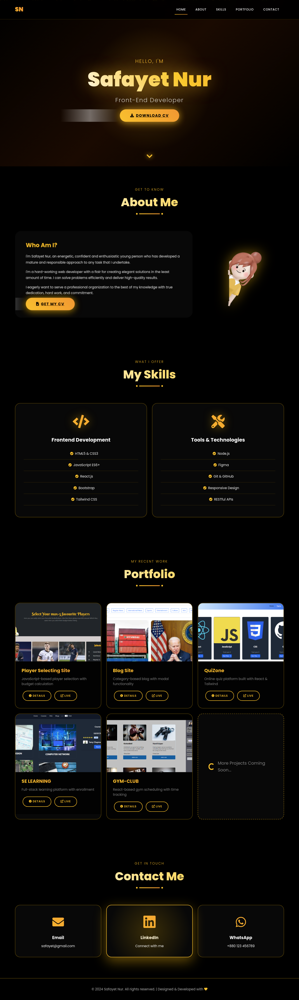

# Portfolio-Project-HTML

[Live Demo](https://electra51.github.io/Portfolio-Project-HTML/)

## Project Overview

This is my personal front-end developer portfolio website.  
It showcases my introduction, skills, projects, and contact information.  
I, **Safayet Nur**, present myself as a Front-End Developer through this portfolio.

## Built With

- HTML5 & CSS3  
- JavaScript (ES6+)  
- Responsive Web Design  
- Git & GitHub for version control

## Features

- Homepage with a brief introduction: "Hello, I’m Safayet Nur, Front-End Developer"  
- About section – information about me and my work  
- Skills section – lists of frontend development skills and tools  
- Portfolio section – showcasing my recent projects  
- Contact section – email, LinkedIn, WhatsApp links  
- Fully responsive and mobile-friendly design

## Preview

<div align="start">
  
</div>

## Getting Started

### Prerequisites  
- Modern web browser (Chrome, Firefox, Safari, etc.)  
- Internet connection (for Live Demo or external links)

### Installation  
1. Clone this repository:  
   ```bash
   git clone https://github.com/your-username/Portfolio-Project-HTML.git


 ## Author

**Electra51**

- **GitHub**: [@Electra51](https://github.com/Electra51)
- **LinkedIn**: https://www.linkedin.com/in/safayet-nur/
- **Email**: safayetnurelectra@gmail.com
- **Portfolio**: https://nextjs-my-portfolio-electra51.vercel.app/
- **Twitter**: https://x.com/nur_safaye51

---


## Support

If you like this project, please ⭐ star this repository!

---


**Star this repository if you found it helpful!**
### Made with ❤️ by Electra51
Happy Coding! 🚀
